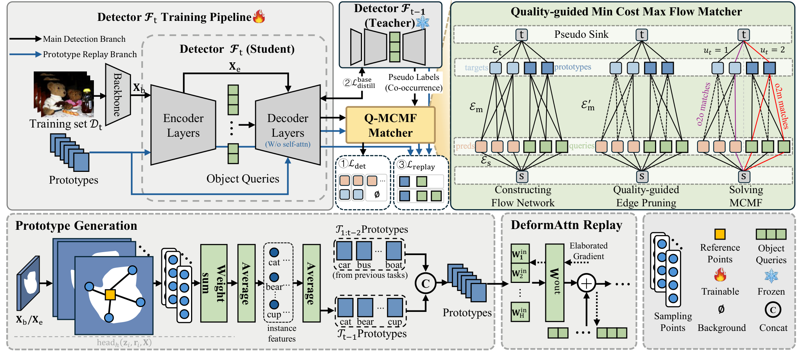

# Q-MCMF++: Generalizable Quality-Guided Matcher for Incremental Detection Transformer

> **Q-MCMF (AAAI 2026)** — **Q-MCMF++ (Extended Version)**  
> Qirui Wu, Shizhou Zhang, De Cheng, Yinghui Xing, Lingyan Ran, Dahu Shi, Peng Wang, Yanning Zhang

This repository contains the official implementation of **Q-MCMF** (AAAI 2026) and the upcoming code for its journal extension **Q-MCMF++**.

## Abstract

Incremental Object Detection is critical for deploying detection systems in dynamic environments, as models must continuously learn novel categories without forgetting prior knowledge. While Detection Transformer (DETR) has emerged as a powerful detection paradigm, it suffers from severe catastrophic forgetting in such incremental settings. In this work, we propose Q-MCMF++, a unified framework that equips DETR with robust continual learning capabilities. Specifically, we identify that the exhaustive Hungarian matching in DETR forces geometrically implausible prediction-target assignments, causing background regions to be incorrectly supervised as foreground, a phenomenon we term *background foregrounding*, which causes catastrophic forgetting. To resolve this, we design a Quality-guided Min-Cost Max-Flow (Q-MCMF) matcher that replaces Hungarian matching with a flow optimization formulation, using quality-guided edge pruning to eliminate implausible matches while preserving one-to-one correspondence and maximizing valid assignments. Furthermore, to handle the stringent non-co-occurrence scenario where old classes are entirely absent from new data, we introduce a prototype replay mechanism that decouples feature aggregation from learnable projections in deformable attention to construct compact class-wise prototypes, and repurposes Q-MCMF in a one-to-many configuration for selective query-prototype matching. Experimental results on the COCO dataset demonstrate that our approach significantly alleviates catastrophic forgetting and achieves state-of-the-art performance across both co-occurrence and non-co-occurrence protocols.

## 🧩 Overview

We propose a Quality-guided Min-Cost Max-Flow (Q-MCMF) matcher for incremental object detection in DETR-based detectors, and extend it to a unified framework with prototype replay.

<p align="center">
  
  <br>
  <em>Main framework of our method. Two branches are included in the training pipeline. The first branch corresponds to the original detection pipeline, where the standard Hungarian matcher is replaced by our proposed Q-MCMF matcher. Pseudo-labeling and basic knowledge distillation are applied as fundamental anti-forgetting measures. Pseudo-labeling strategy is adopted only under the co-occurrence scenario. The second branch illustrates our prototype replay strategy, which constructs class-wise prototypes by decoupling feature aggregation from learnable projections in deformable attention, and repurposes Q-MCMF in a one-to-many configuration (right part of the flow network) to selectively associate each prototype with compatible queries. The lower part of the figure shows the detailed pipeline of prototype generation and its replay process in Deformable Attention (DeformAttn replay).</em>
</p>

- **Background Foregrounding.** We identify that the exhaustive Hungarian matching in DETR forces geometrically implausible prediction-target assignments, causing erroneous supervision that leads to catastrophic forgetting.
- **Q-MCMF Matcher.** We reformulate label assignment as a min-cost max-flow problem with quality-guided edge pruning, eliminating implausible matches while preserving valid one-to-one correspondence.
- **Prototype Replay (Q-MCMF++).** To handle non-co-occurrence scenarios, we introduce a prototype replay mechanism with decoupled feature aggregation. Q-MCMF is repurposed in a one-to-many configuration for selective query-prototype matching.

## 🚀 Getting Started

This is the preliminary code release for the **Q-MCMF** conference paper. The full **Q-MCMF++** code will be released within two weeks (by **August 7, 2026**). ⏳

### Installation

This code is based on Deformable DETR. Follow the instructions below to set up the environment:

```bash
conda create -n qmcmf python=3.12 pip
conda activate qmcmf
pip install torch==2.7.0 torchvision --index-url https://download.pytorch.org/whl/cu128
pip install -r requirements.txt
```

Compile CUDA operators:

```bash
cd ./models/ops
sh ./make.sh
# unit test (should see all checking is True)
python test.py
```

### Dataset Preparation

Download [COCO 2017 dataset](https://cocodataset.org/) and organize as:

```
code_root/
└── data/
    └── coco/
        ├── train2017/
        ├── val2017/
        └── annotations/
            ├── instances_train2017.json
            └── instances_val2017.json
```

### Running Experiments

```bash
# 70+10 class-split (Protocol 1) with Q-MCMF
python main.py --data_setting class_split --num_of_phases 2 --base_cls 70 --cls_per_phase 10 --use_qmcmf

# 40+40 class-split (Protocol 1) with Q-MCMF
python main.py --data_setting class_split --num_of_phases 2 --base_cls 40 --cls_per_phase 40 --use_qmcmf

# 70+10 image-split (Protocol 2) with Q-MCMF
python main.py --data_setting image_split --num_of_phases 2 --base_cls 70 --cls_per_phase 10 --use_qmcmf
```

**Key arguments:**

| Argument | Default | Description |
|----------|---------|-------------|
| `--data_setting` | `image_split` | `class_split` (by category) or `image_split` (by image) |
| `--num_of_phases` | 2 | Number of incremental phases |
| `--base_cls` | 70 | Number of classes in phase 0 |
| `--cls_per_phase` | 10 | Classes per incremental phase |
| `--use_qmcmf` | False | Enable Q-MCMF matcher (vs Hungarian) |
| `--qmcmf_iou_thresh` | 0.5 | IoU threshold for new-class matching |
| `--qmcmf_pseudo_iou_thresh` | 0.7 | IoU threshold for old-class pseudo-label matching |
| `--seed_cls` | 123 | Random seed for class order |
| `--seed_data` | 123 | Random seed for data split |

> Note: The default configuration uses 4 GPUs with a per-GPU batch size of 8 (effective batch size of 32).

## 📖 Citation

If you find this work helpful, please consider citing:

```bibtex
@inproceedings{wu2026qmcmf,
  title={Q-MCMF: Quality-Guided Min-Cost Max-Flow Matcher for Incremental Detection Transformer},
  author={Wu, Qirui and Zhang, Shizhou and Cheng, De and Xing, Yinghui and Ran, Lingyan and Shi, Dahu and Wang, Peng and Zhang, Yanning},
  booktitle={Proceedings of the AAAI Conference on Artificial Intelligence},
  year={2026}
}
```

## Acknowledgement

Our implementation uses the source code from the following repositories:
- [CL-DETR](https://github.com/yaoyao-liu/CL-DETR) (CVPR 2023)
- [Deformable DETR](https://github.com/fundamentalvision/Deformable-DETR) (ICLR 2021)
- [DETR](https://github.com/facebookresearch/detr) (ECCV 2020)
